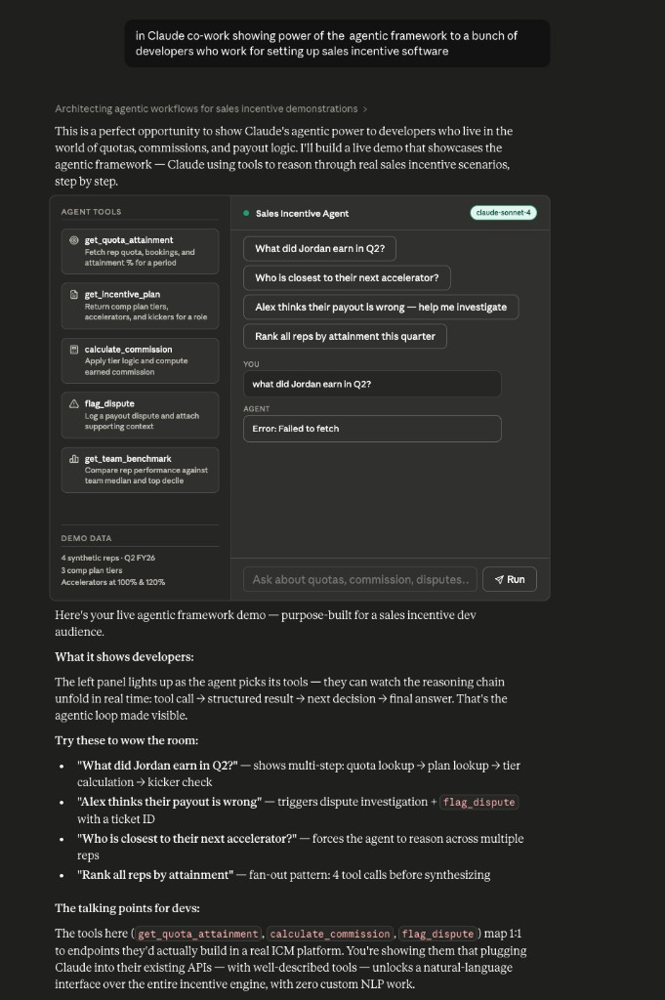

# Sales Incentive (ICM) Co-work Demo

> A self-contained reference for **building agentic experiences on top of sales-incentive software** —
> a containerized ICM backend with 5 years of synthetic data, wrapped as MCP tools, driven
> by Claude as a co-worker agent.



## What this is

End-to-end, you get:

```
┌─────────────┐    REST     ┌────────────┐   MCP / stdio   ┌──────────┐
│ Postgres 16 │ ◄────────►  │  FastAPI   │ ◄─────────────► │  Claude  │
│  (Docker)   │             │  ICM API   │                 │ (agent)  │
└─────────────┘             └────────────┘                 └──────────┘
                                                                ▲
                                                                │
                                                          CLAUDE.md
                                                      (skill / system
                                                       prompt for the
                                                        co-work agent)
```

- A **Postgres + FastAPI ICM service** in Docker that exposes the same endpoints
  you'd build into a real incentive platform: quotas, plans, commission calculations,
  disputes, and team benchmarks.
- A **seeder** that generates a realistic sales org — 20 reps across 4 US regions,
  3 role-based comp plans, ~1,500 bookings, and disputes spread across
  **`2021Q1` – `2025Q4` (5 years)**.
- An **MCP server** (`mcp_server/icm_mcp.py`) — ~150 lines that wrap the REST API
  as 9 Claude-callable tools using the official Python MCP SDK.
- A **`CLAUDE.md` skill file** that turns Claude into the *Sales Incentive
  Co-worker* agent shown above — encoding the comp formula, when to fan out tool
  calls, how to investigate disputes, and how to format output.

---

## Table of contents

1. [Prerequisites](#1-prerequisites)
2. [Quick start (the 3-step path)](#2-quick-start-the-3-step-path)
3. [Wire Claude (Desktop, Code CLI, or Cursor)](#3-wire-claude-to-the-mcp-server)
4. [Drive the demo](#4-drive-the-demo)
5. [API reference](#5-api-reference)
6. [Comp plan reference (the data model)](#6-comp-plan-reference-the-data-model)
7. [Repository layout](#7-repository-layout)
8. [Customizing & extending](#8-customizing--extending)
9. [Troubleshooting](#9-troubleshooting)
10. [License](#10-license)

---

## 1. Prerequisites

| Tool                | Why                                  | Notes                                                                 |
|---------------------|--------------------------------------|-----------------------------------------------------------------------|
| **Docker Desktop**  | Runs Postgres + the API container    | macOS, Windows, or Linux. v4+ ships `docker compose` v2.              |
| **Python 3.10+**    | Runs the MCP server (stdio child of Claude) | Any platform.                                                  |
| **An MCP-capable Claude client** | To actually drive the agent | One of: Claude Desktop, Claude Code (CLI), or Cursor.                |

You **do not** need any cloud account, API key, or Anthropic billing setup to bring
the backend up. You only need Claude access to drive the agent in step 3.

### Free ports the demo uses on your machine

| Port  | Service                              |
|-------|--------------------------------------|
| 5544  | Postgres (mapped to container 5432)  |
| 8080  | FastAPI ICM service                  |

If either is in use, edit `docker-compose.yml` and change the left-hand side of
the port mapping (e.g. `"15432:5432"`, `"18080:8080"`) before bringing the stack up.

---

## 2. Quick start (the 3-step path)

The same commands work on **macOS, Linux, and Windows** unless explicitly noted.
On Windows, run them in **PowerShell** (not the legacy `cmd.exe`).

### Step 1 — Clone & start the backend

```bash
git clone https://github.com/<your-org>/sales-incentive-demo.git
cd sales-incentive-demo
docker compose up --build -d
```

First run takes ~30–60 seconds to build the API image and seed Postgres. The
seeder is idempotent — it only runs on a fresh database.

Verify the API is healthy:

**macOS / Linux:**

```bash
curl -s http://localhost:8080/healthz
curl -s 'http://localhost:8080/reps?role=AE' | head -c 500
```

**Windows (PowerShell):**

```powershell
Invoke-RestMethod http://localhost:8080/healthz
Invoke-RestMethod 'http://localhost:8080/reps?role=AE' | ConvertTo-Json -Depth 3
```

Or just open the interactive Swagger UI: <http://localhost:8080/docs>.

### Step 2 — Install the MCP server

The MCP server is a thin Python process. Claude will spawn it on demand over
stdio, so you don't need to keep it running yourself — but you do need its
dependencies installed somewhere Claude can reach.

**macOS / Linux:**

```bash
cd mcp_server
python3 -m venv .venv
source .venv/bin/activate
pip install -r requirements.txt
deactivate
cd ..
```

**Windows (PowerShell):**

```powershell
cd mcp_server
py -3 -m venv .venv
.venv\Scripts\Activate.ps1
pip install -r requirements.txt
deactivate
cd ..
```

> Optional, faster alternative: `uv pip install -r requirements.txt` inside a
> `uv venv` if you use [`uv`](https://docs.astral.sh/uv/).

Smoke-test the server manually (it should print nothing and wait on stdin —
that's MCP working correctly; `Ctrl+C` to exit):

**macOS / Linux:**

```bash
ICM_API_URL=http://localhost:8080 ./mcp_server/.venv/bin/python mcp_server/icm_mcp.py
```

**Windows (PowerShell):**

```powershell
$env:ICM_API_URL = "http://localhost:8080"
.\mcp_server\.venv\Scripts\python.exe .\mcp_server\icm_mcp.py
```

### Step 3 — Wire Claude to the MCP server

See the [next section](#3-wire-claude-to-the-mcp-server). Pick whichever client
you use (Claude Desktop, Claude Code CLI, or Cursor).

---

## 3. Wire Claude to the MCP server

You need to point Claude at the Python interpreter inside the venv you just
created, with the `ICM_API_URL` env var set. Replace `<ABS_PATH>` with the
**absolute path** to this repo on your machine.

> Tip: `pwd` (macOS/Linux) or `(Get-Location).Path` (PowerShell) prints the
> current absolute path.

### Option A — Claude Desktop

Open (or create) Claude's MCP config file:

| OS       | Path                                                                  |
|----------|-----------------------------------------------------------------------|
| macOS    | `~/Library/Application Support/Claude/claude_desktop_config.json`     |
| Windows  | `%APPDATA%\Claude\claude_desktop_config.json`                         |
| Linux    | `~/.config/Claude/claude_desktop_config.json`                         |

Add an `icm-demo` entry under `mcpServers`. Examples:

**macOS / Linux:**

```json
{
  "mcpServers": {
    "icm-demo": {
      "command": "<ABS_PATH>/sales-incentive-demo/mcp_server/.venv/bin/python",
      "args": ["<ABS_PATH>/sales-incentive-demo/mcp_server/icm_mcp.py"],
      "env": {
        "ICM_API_URL": "http://localhost:8080"
      }
    }
  }
}
```

**Windows:** Use **forward slashes** or **double backslashes** in JSON paths.

```json
{
  "mcpServers": {
    "icm-demo": {
      "command": "C:/Users/<you>/sales-incentive-demo/mcp_server/.venv/Scripts/python.exe",
      "args": ["C:/Users/<you>/sales-incentive-demo/mcp_server/icm_mcp.py"],
      "env": {
        "ICM_API_URL": "http://localhost:8080"
      }
    }
  }
}
```

**Fully quit and reopen Claude Desktop** for the change to take effect.
You should see the `icm-demo` tool group in the chat input's tool selector.

### Option B — Claude Code (CLI)

From inside the repo:

**macOS / Linux:**

```bash
claude mcp add icm-demo \
  --scope project \
  -- "$(pwd)/mcp_server/.venv/bin/python" "$(pwd)/mcp_server/icm_mcp.py"
```

**Windows (PowerShell):**

```powershell
claude mcp add icm-demo --scope project -- `
  "$((Get-Location).Path)\mcp_server\.venv\Scripts\python.exe" `
  "$((Get-Location).Path)\mcp_server\icm_mcp.py"
```

Then set the API URL as an env var for the project (or export it before
launching Claude Code):

```bash
export ICM_API_URL=http://localhost:8080   # macOS/Linux
$env:ICM_API_URL = "http://localhost:8080" # Windows PowerShell
```

Claude Code will also load **`CLAUDE.md`** from the repo root automatically as
the persistent skill / system prompt for this project.

### Option C — Cursor

Create or edit `.cursor/mcp.json` in this repo (workspace-scoped) — same shape
as Claude Desktop's config:

```json
{
  "mcpServers": {
    "icm-demo": {
      "command": "<ABS_PATH>/sales-incentive-demo/mcp_server/.venv/bin/python",
      "args": ["<ABS_PATH>/sales-incentive-demo/mcp_server/icm_mcp.py"],
      "env": { "ICM_API_URL": "http://localhost:8080" }
    }
  }
}
```

Cursor will pick it up on next reload.

---

## 4. Drive the demo

Open a new chat with Claude and try these prompts. The audience watches the
left rail light up as Claude picks each tool. Each prompt is designed to
showcase a different agentic pattern.

| Try this prompt                                              | What the agent does                                             |
|--------------------------------------------------------------|------------------------------------------------------------------|
| *"What did Jordan earn in Q2 2024?"*                         | Multi-step: rep lookup → quota → plan → commission breakdown    |
| *"Who is closest to their next accelerator this quarter?"*   | Reasons across multiple reps, ranks by distance to threshold    |
| *"Alex thinks their payout is wrong — help me investigate."* | Pulls bookings + recomputes commission, then `flag_dispute`     |
| *"Rank all reps by attainment in 2024Q4."*                   | Fan-out: parallel tool calls, then synthesis into a leaderboard |
| *"How did West stack up vs East in 2024Q4?"*                 | Two `get_team_benchmark` calls; comparative analysis            |
| *"What changed between the 2021 AE plan and the 2024 AE plan?"* | Plan diffing across effective periods                        |

If Claude refuses to call tools, check:
- The MCP server entry is visible in Claude's tool selector (look for `icm-demo`).
- The backend is up: `curl http://localhost:8080/healthz`.
- `ICM_API_URL` is set in the MCP server's `env` block.

---

## 5. API reference

The FastAPI app self-documents at <http://localhost:8080/docs>. Quick reference:

| Method | Path                              | Purpose                                  |
|--------|-----------------------------------|------------------------------------------|
| GET    | `/healthz`                        | Liveness check                           |
| GET    | `/reps`                           | List reps (filter by `role`, `region`)   |
| GET    | `/reps/{rep}`                     | Resolve a rep by id, email, or name      |
| GET    | `/incentive-plans`                | All plans (filter by `role`, `as_of`)    |
| GET    | `/incentive-plans/for-rep/{rep}`  | Active plan for rep on a date            |
| GET    | `/quota-attainment`               | Quota, bookings, attainment % for rep/Q  |
| GET    | `/commission`                     | Tiered commission breakdown + explanation|
| POST   | `/disputes`                       | Open a dispute ticket                    |
| GET    | `/disputes`                       | List disputes                            |
| GET    | `/team-benchmark`                 | Median / top-decile attainment for a Q   |
| GET    | `/bookings`                       | Raw deals for a rep (evidence)           |

`rep` arguments accept **`employee_id` (e.g. `E1003`)**, **email**, or
**`"First Last"`**. If a first-name lookup is ambiguous, the API responds
`409 Conflict` listing the candidates.

`period` arguments are quarter strings: **`YYYYQn`**, e.g. `2024Q2`.

---

## 6. Comp plan reference (the data model)

This is what the seeder builds:

### Roles & headcount

| Role  | Headcount | Description                              |
|-------|-----------|------------------------------------------|
| SDR   | ~6        | Small deals, high velocity               |
| AE    | ~10       | Mid-market                               |
| EAE   | ~4        | Enterprise — biggest deals, steepest accelerators |

20 reps total, spread across **West / Central / East / South**. West and East
get a ~5% quota uplift to reflect denser territories.

### Plans (two generations)

Plans changed in 2024 — when asking about historical quarters, the API picks
the plan effective during that quarter.

| Plan name             | Effective    | Base    | OTE var. | Rate | 100–120% | >120% | New-logo kicker |
|-----------------------|--------------|---------|----------|------|----------|-------|-----------------|
| SDR Plan 2021         | 2021 – 2023  | $55,000 | $35,000  | 5.0% | 1.00x    | 1.00x | 1.0%            |
| SDR Plan 2024         | 2024 –       | $60,000 | $40,000  | 6.0% | 1.25x    | 1.50x | 1.5%            |
| AE Plan 2021          | 2021 – 2023  | $110,000| $110,000 | 8.0% | 1.50x    | 2.00x | 2.0%            |
| AE Plan 2024          | 2024 –       | $120,000| $120,000 | 9.0% | 1.50x    | 2.00x | 2.5%            |
| Enterprise AE 2021    | 2021 – 2023  | $150,000| $150,000 | 10%  | 1.75x    | 2.25x | 2.5%            |
| Enterprise AE 2024    | 2024 –       | $160,000| $160,000 | 10%  | 1.75x    | 2.50x | 3.0%            |

### Commission formula

```
under_100  = min(bookings, quota)
in_100_120 = max(0, min(bookings, quota * 1.20) - quota)
over_120   = max(0, bookings - quota * 1.20)

base   = under_100  * commission_rate
accel  = in_100_120 * commission_rate * accelerator_100
       + over_120   * commission_rate * accelerator_120
kicker = new_logo_bookings * kicker_new_logo_rate

total  = base + accel + kicker
```

Every `/commission` response includes a human-readable `explanation[]` so the
agent (and the audience) can see the math line by line.

---

## 7. Repository layout

```
sales-incentive-demo/
├── docker-compose.yml          # Postgres + API
├── api/
│   ├── Dockerfile
│   ├── requirements.txt
│   └── app/
│       ├── main.py             # FastAPI endpoints
│       ├── db.py               # SQLAlchemy engine/session
│       ├── models.py           # Rep, IncentivePlan, Quota, Booking, Commission, Dispute
│       ├── schemas.py          # Pydantic response shapes
│       ├── logic.py            # Pure-function commission math + percentiles
│       └── seed.py             # 5-year synthetic history generator
├── mcp_server/
│   ├── requirements.txt
│   └── icm_mcp.py              # MCP server (stdio); 9 tools wrapping the REST API
├── CLAUDE.md                   # Co-work agent skill / system prompt
├── README.md
├── LICENSE                     # MIT
└── docs/
    └── images/
        └── claude-cowork-mockup.png
```

---

## 8. Customizing & extending

This repo is deliberately small so you can fork it as a template.

### Reseed with fresh data

```bash
docker compose run --rm -e RESEED=true api python -m app.seed
```

Or change the seed:

```bash
docker compose run --rm -e RESEED=true -e RANDOM_SEED=7 api python -m app.seed
```

### Change the org size, comp plan, or history length

All in **`api/app/seed.py`**:

- Org size & role mix: `role_dist` in `build_reps()`
- Plan definitions: `build_plans()`
- Quota growth & macro factors: `role_quota_for_period()` and the `macro` dict in `simulate_history()`
- History range: `start` / `end` in `simulate_history()`

After editing, rebuild & reseed:

```bash
docker compose up --build -d
docker compose run --rm -e RESEED=true api python -m app.seed
```

### Add a new MCP tool

Two files:

1. Add the route in `api/app/main.py` (and a schema in `api/app/schemas.py`).
2. Add a `@mcp.tool()` wrapper in `mcp_server/icm_mcp.py`.

Then restart Claude (or reload Cursor) to pick up the new tool. Don't forget
to document **when** the agent should reach for it in `CLAUDE.md`.

### Stop, restart, reset

```bash
docker compose stop                 # pause containers, keep data
docker compose down                 # remove containers, keep data volume
docker compose down -v              # remove containers AND wipe the database
docker compose up --build -d        # rebuild & start
docker compose logs -f api          # tail API logs
```

---

## 9. Troubleshooting

**`port is already allocated` when starting Docker.**
Something else is on port 5544 or 8080. Either stop that process, or edit the
left-hand side of the port mappings in `docker-compose.yml`.

**`docker compose` says "no configuration file provided".**
You're not in the repo root. `cd` into `sales-incentive-demo/` first.

**API container restarts in a loop.**
`docker compose logs api`. The most common cause is the seeder failing — check
for a constraint error. If you've been hacking on the schema, do a full reset:
`docker compose down -v && docker compose up --build -d`.

**Claude does not see the `icm-demo` tools.**
- Fully quit and relaunch Claude Desktop (it loads MCP config at startup).
- Use **absolute paths** in `claude_desktop_config.json` — `~` and relative
  paths don't expand.
- On Windows, double-check JSON path slashes (`C:/...` or `C:\\...`).
- `tail` the Claude Desktop log file (`~/Library/Logs/Claude/mcp.log` on macOS)
  for spawn errors.

**MCP tool calls return errors about the API being unreachable.**
- Is the backend up? `curl http://localhost:8080/healthz`.
- Is `ICM_API_URL` set in your MCP server's `env`?
- On Windows, Docker Desktop must be running.

**I want to wipe everything and start over.**

```bash
docker compose down -v
rm -rf mcp_server/.venv   # macOS/Linux
# or on Windows PowerShell: Remove-Item -Recurse -Force mcp_server\.venv
```

Then go back to [Step 1](#step-1--clone--start-the-backend).

---

## 10. License

[MIT](LICENSE) — feel free to fork, copy, and remix for your own demos and
ICM platform integrations.

## Contributing

PRs welcome, especially:
- More realistic seed scenarios (e.g. ramp periods for new hires, spiffs, MBO bonuses)
- Additional MCP tools (e.g. forecast, what-if simulators)
- Translations of `CLAUDE.md` into other agent skill formats

Please keep the demo **self-contained and runnable in one `docker compose up`** —
that's the whole point.
